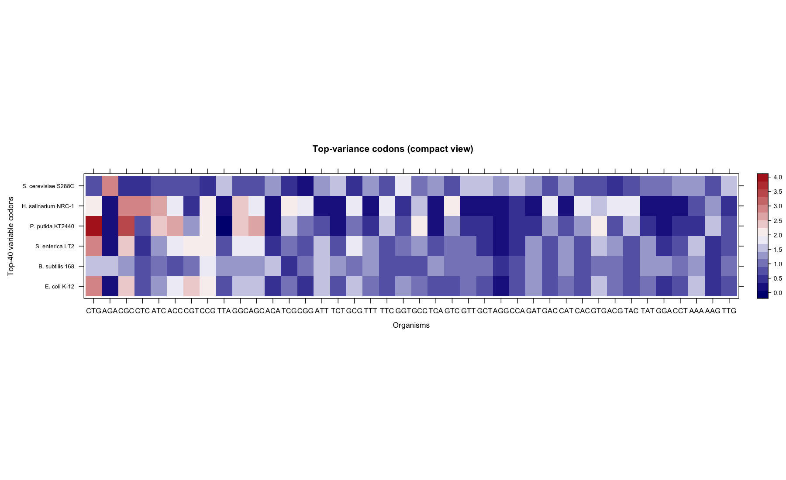
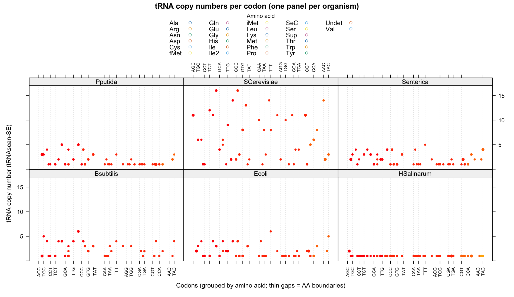
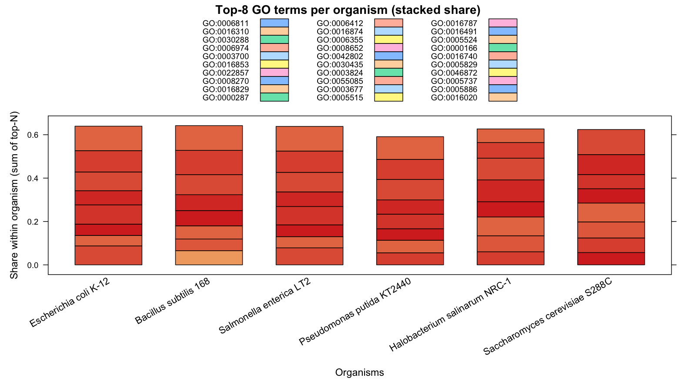
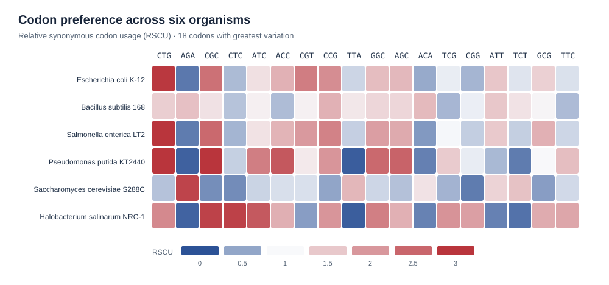

# Bioinformatics analysis of comparative codon usage across 3 domains of life; Bacteria, Archaea, Eukarya 

A University of Waterloo BIOL469 Genomics project; comparing coding-sequence codon usage and tRNA predictions across six organisms. 

This repository contains selected original EMBOSS CUSP and tRNAscan-SE outputs, result figures I made in R for the course project, and **new, post-course Python analysis scripts**. The Python scripts were written for this portfolio version using the archived outputs; they were not the original project's code.

## Project workflow


## Key findings

1. Codon usage varied across the six organisms. The RSCU heatmaps highlight synonymous codons with different usage patterns, particularly when comparing bacteria with yeast and *H. salinarum*.
2. Predicted tRNA gene counts also differed among organisms. These results describe tRNA repertoires; they do not establish that tRNA copy number causes the observed codon preferences.
3. The GO figures summarize the relative prominence of annotations within each organism. They are descriptive comparisons, not statistical enrichment tests.

## Results from the project

I made these original figures in R for the group project. The R source scripts are included under `scripts/r/` in versions adapted to use paths inside this repository. Original Desktop paths were removed, a missing setting was supplied to the codon script, and the tRNA script reads a CSV export of the workbook's summary sheet. The original figures are preserved under `figures/course_results/`; reruns write to `figures/generated_r/`.

**Codon usage:** RSCU values for the 40 codons with the greatest variation across six organisms. The original figure's horizontal labels are codons and its vertical labels are organisms; the axis titles in the image are reversed.



[Full RSCU heatmap (PDF)](figures/course_results/fig1_codon_heatmap_RSCU_vertical_topLabels_25.pdf)

[Alternate horizontal RSCU heatmap (PDF)](figures/course_results/fig1_codon_heatmap_RSCU_horizontal.pdf)

**tRNA predictions:** tRNAscan-SE calls summarized across six organisms. The summary sheet labels its triplet field `Codon`, but values such as `GGC` paired with alanine are anticodons from the tRNA predictions, not coding-sequence codons. The original plot retains its course-project wording; anticodon counts in `results/trna_anticodon_counts.csv` can be inspected directly.



**GO annotations:** relative prominence of the most frequent GO terms among the archived annotations (`data/go/go_annotations_summary.csv`). These are descriptive summaries, not a statistical GO enrichment test.



[GO prominence bubble plot (PNG)](figures/course_results/fig2_GO_bubble.png) 

### Recreate the R figures

From the repository root, with R and the `readr`, `stringr`, and `lattice` packages installed:

```bash
Rscript scripts/r/codon_heatmap.R
Rscript scripts/r/go_terms_bubble_plot.R
Rscript scripts/r/trna_copy_numbers.R
```

`data/cusp/` supplies the codon tables, `data/go/go_annotations_summary.csv` supplies GO counts, and `data/trnascan/summary_outputs.csv` is an export of the workbook's summary sheet. The scripts were reviewed for file paths but **could not be executed in the packaging environment**, which does not have R. The archived course figures remain available even if a rerun produces a different appearance.

## Reproducible portfolio view



**Relative synonymous codon usage (RSCU)** compares each codon's observed count with an equal-use expectation among codons encoding the same amino acid. The heatmap shows 18 codons with the most variable RSCU among the six organisms, selected from the archived CUSP tables. Colors describe differences in this dataset; they are not statistical significance tests. Run `scripts/plot_rscu.py` to regenerate the figure.

## Organisms and inputs

| Organism | CDS accession in original FASTA headers | tRNA scan accession |
| --- | --- | --- |
| *Escherichia coli* K-12 | NC_007779.1 | NC_007779.1 |
| *Bacillus subtilis* 168 | NC_000964.3 | NC_000964.3 |
| *Salmonella enterica* LT2 | NC_003197.2 | NC_003197.2 |
| *Pseudomonas putida* KT2440 | NC_002947.4 | NC_002947.4 |
| *Saccharomyces cerevisiae* S288C | NC_001133.9 (one of several chromosomes) | NC_001133.9 (one of several chromosomes) |
| *Halobacterium salinarum* NRC-1 | NC_002607.1 | NC_002607.1 |

`data/cusp/` contains archived EMBOSS CUSP codon usage tables for annotated CDS FASTA files. `data/trnascan/` contains archived tRNAscan-SE `.out` calls. `data/ref/` contains six archived CDS FASTA files for reference. Some FASTA headers and scan outputs span several chromosomes or replicons; the accession shown is an example, **not a complete list**. These are **coding-sequence counts**, not raw whole-genome trinucleotide frequencies.

**FASTA provenance:** The archived FASTA files have not been established as the exact inputs that produced every CUSP table. Their record counts differ from five of the six tables (for example, 4,410 sequences in `K12genomic.fna` versus `#CdsCount: 4775` in `K12codonusage.txt`). The analysis scripts use the saved CUSP tables as their inputs, not these reference FASTA files. Avoid claiming full end-to-end reproduction from the FASTAs until the input versions and annotations are reconciled.

## Reproduce the portfolio analysis

Requires Python 3.9+ and no third-party packages:

```bash
python3 scripts/analyze_codon_bias.py --output results
python3 scripts/plot_rscu.py --input results/rscu_by_organism.csv --output figures/rscu_heatmap.svg
```

The first script writes:

- `results/rscu_by_organism.csv`: observed codon counts and RSCU. For each amino acid, RSCU = observed codon count / (total counts for that amino acid / number of synonymous codons).
- `results/trna_anticodon_counts.csv`: counts of tRNAscan-SE calls grouped by amino acid and anticodon, excluding entries labeled `Undet`, `NNN`, or `pseudo`.
- `results/organism_summary.csv`: total codons in the archived CUSP table and retained tRNA calls for each organism.

The second script makes the SVG above directly from the saved RSCU CSV. The `results/` and `figures/` directories contain example outputs from the supplied data.

## Scope and interpretation

The original course project also examined GO annotations and selected ribosomal proteins. This repository includes selected original GO figures but its runnable scripts focus on codon and tRNA tables. The original workflow used EMBOSS CUSP on annotated CDS FASTA files and tRNAscan-SE on genomes; these Python scripts start **after** those tools and do not redo genome annotation or tRNA scanning. Anticodon abundance alone does not establish one-to-one codon translation because wobble pairing and modifications matter. No statistically tested relationship between tRNA copy number and codon preference is claimed here. 
